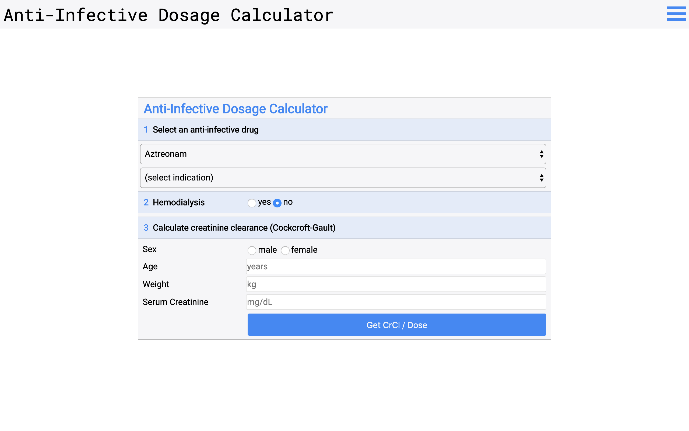
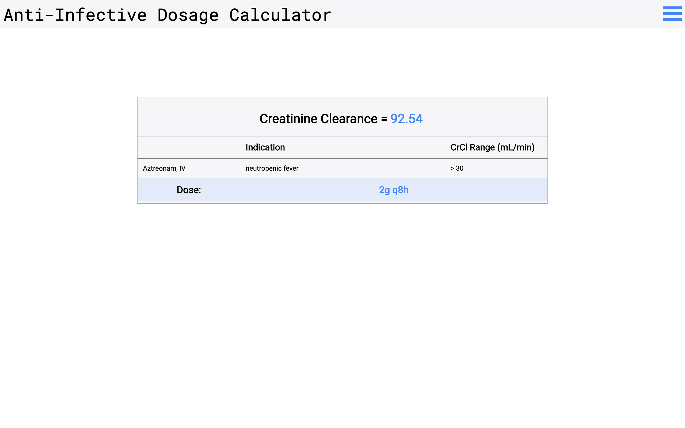

# Anti-Infective Dosage Calculator
https://dosage-calculator.herokuapp.com

Web app that calculates creatinine clearance and renders the corresponding UW Medicine Renal Dosing Guidelines, given user-inputted medication, indication and patient-specific parameters and selected anti-infective drug.

# Author
[Ellen Conley](https://github.com/egconley)

# Built with
* [Node.js](https://nodejs.org/en/)
* [npm](https://www.npmjs.com/)
* [Express.js](https://expressjs.com/)
* [postgreSQL](https://www.postgresql.org/)
* [EJS](https://ejs.co/)
* [Auth0](https://auth0.com/docs/quickstarts)
* [Passport.js](http://www.passportjs.org/docs/)

# Screenshots

# Resources
* [2016-2017 UCLA Health Adult Anti-Infective Dosing Guidelines](https://asp.mednet.ucla.edu/files/view/UCLAAdultDosingCard.pdf)
* [UW Medicine Renal Dosing Guidelines](https://occam.uwmedicine.org/antibiotic-reference-kit/uw-medicine-renal-dosing-guidelines/)
* [NIH Antiretroviral Dosing Recommendations in Patients with Renal or Hepatic Insufficiency](https://aidsinfo.nih.gov/guidelines/htmltables/1/7257)

### Cockcroft-Gault Equation
Creatinine Clearance = Sex * ((140 - Age) / (Serumcreatinine)) * (Estimatedleanbodyweight / 72)

[UpToDate Creatinine Clearance Calculator](https://www-uptodate-com.offcampus.lib.washington.edu/contents/calculator-creatinine-clearance-estimate-by-cockcroft-gault-equation-in-adults-and-older-adolescents-age-18-years?search=creatinine%20clearance%20calculator&source=search_result&selectedTitle=1~150&usage_type=default&display_rank=1)
